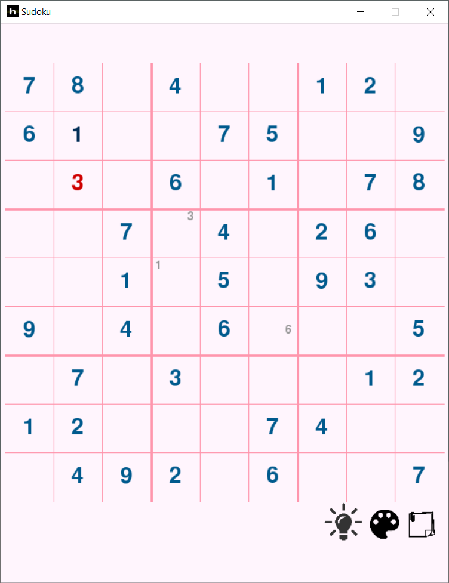
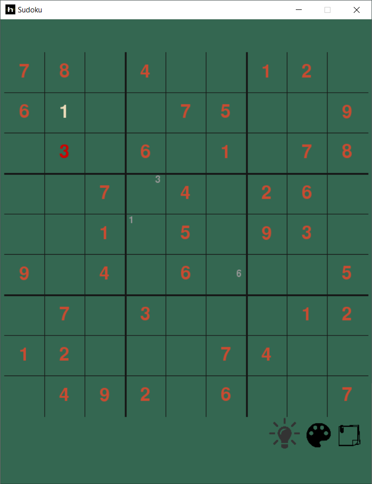
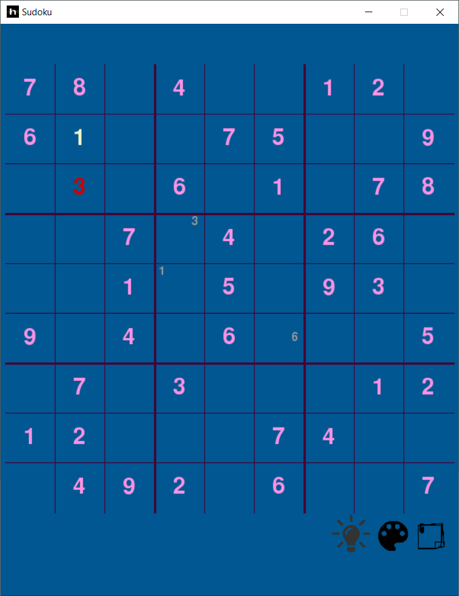
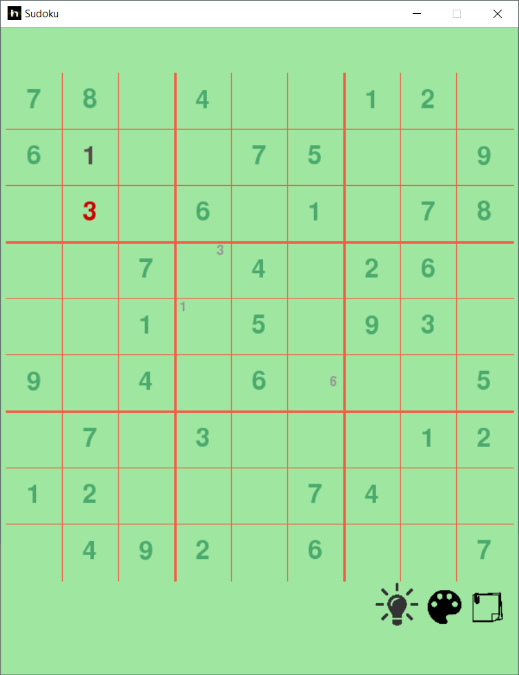
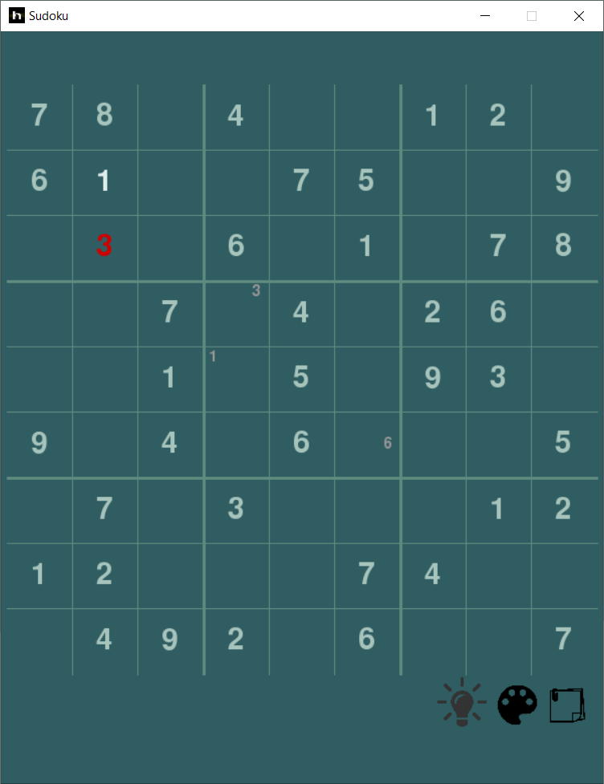
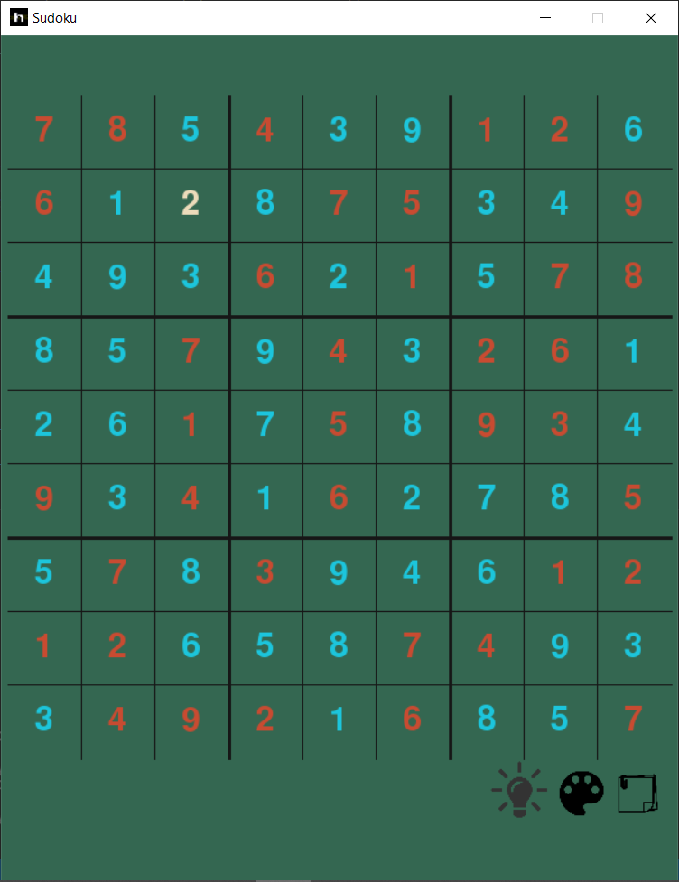

# Sudoku_Backtracking

This repo presents a python implementation of the [backtracking](https://www.geeksforgeeks.org/backtracking-algorithms/) algorithm for sudoku solving implemented using [NumPy](https://numpy.org/) for faster computation.

## Installation

Use the package manager [pip](https://pip.pypa.io/en/stable/) to install the requirements.

*Make sure you're in the package directory before running the following command.*

```bash
pip install -r requirements.txt
```

## Usage
*It may be* ```python3``` *for you, this depends on how you aliased your python version.*
```bash
python gui.py
```
* The *note* icon is to toggle the note mode.
* The *paint* icon is to change the theme
* The *lamp* icon is to solve the sudoku using the implemented backtracking algorithm.
## Color Themes
<div class="image123">
    <div class="imgContainer">
        
        
        
    </div>
    <div class="imgContainer">
        
        
        
    </div>
    </div>
</div>

## Contributing
Pull requests are welcome. For major changes, please open an issue first to discuss what you would like to change.

## License
[MIT](https://choosealicense.com/licenses/mit/)
